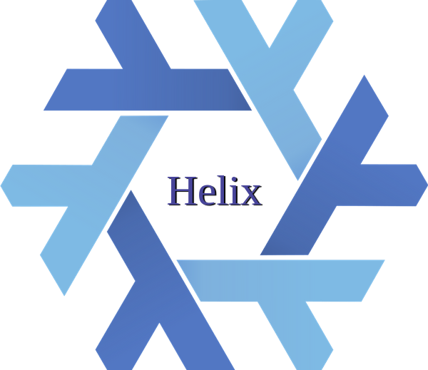

###### *<div align="right"><sub>// made by its-19818942118 & derDelphin</sub></div>*

</br><div align="center"></br></div>

<!-- <div align = center>
    <a href="https://discord.gg/AYbJ9MJez7">

    </a>
</div> -->

<div align="center">

</br>

  <a href="#introduction"><kbd> </br> Introduction </br> </kbd></a>&ensp;&ensp;
  <a href="#features"><kbd> </br> Features </br> </kbd></a>&ensp;&ensp;
  <a href="#installation"><kbd> </br> Installation </br> </kbd></a>&ensp;&ensp;
  <!-- <a href="#themes"><kbd> </br> Themes </br> </kbd></a>&ensp;&ensp;
  <a href="#styles"><kbd> </br> Styles </br> </kbd></a>&ensp;&ensp;
  <a href="#keybindings"><kbd> </br> Keybindings </br> </kbd></a>&ensp;&ensp;
  <a href="https://github.com/prasanthrangan/hyprdots/wiki"><kbd> </br> Wiki </br> </kbd></a>&ensp;&ensp;
  <a href="https://discord.gg/qWehcFJxPa"><kbd> </br> Discord </br> </kbd></a> -->

</div></br></br>

<!-- https://github.com/prasanthrangan/hyprdots/assets/106020512/7f8fadc8-e293-4482-a851-e9c6464f5265 -->

## Introduction

Helix is like Hyde or Hyprdots dots for Hyprland and NixOS instead of Arch linux and we aim to provide absoulute freedom for you the user. You choose what to setup and what packages to install, where the scripts, themes, wallpapers, cache, the Helix folder and more are located. We've two methods to install Helix and a third will be available in the future. The first is an Default install, these are ours, the maintainers, preferences when it comes to the packages, themes and more. The second method is where you comes in and selects nearly anything, from the packages to be install, over the location for the dots, wallpaper, themes... We can't and won't provide dots for all packages that exists.

> [!CAUTION]
> Before the final installation of Helix you'll be asked to list additional packages you want to install, end the installation or skip this step and install Helix. The entered packages will get validated and we will ask a second time before finally installing Helix and these packages if you selected to do so. You'll be able to cancel the installation at any point and even at this point,if you want to setup something yourself that we haven't or tweak the current configurations. When you are done just execute the install script again and it will skip all options which you've already selected and let you install Helix and ask you again if you want to add any packages or tweak the configurations.

## Features

Helix and gnu/linux are very simuilar for both of them means freedom anything and with Helix you've the ultimate freedom, it's your system so you choose what packages to install, where to store the themes, wallpaper, Helix' cache and all this stuff. The highlights and features are:
- nvidia support(open)
- home manager support(in preparation for helix)
- shell selection
- idle manager selection
- shader selection
- notification daemon/center selection
- autostart apps
- *gaming mode*
- game launcher
- systemwide themes(gtk- and qt-apps, spotify, discord, browser if possible)

## Installation

The installation script is designed for a minimal [NixOS](https://wiki.nixos.org/wiki/NixOS_Wiki) install.
While installing Helix alongside another [DE](https://wiki.nixos.org/wiki/Category:Desktop)/[WM](https://wiki.archlinux.org/title/Window_manager) should work, due to it being a heavily customized setup, it **will** conflict with your [GTK](https://wiki.archlinux.org/title/GTK)/[Qt](https://wiki.archlinux.org/title/Qt) theming, [Shell](https://wiki.archlinux.org/title/Command-line_shell), [SDDM](https://wiki.archlinux.org/title/SDDM), [GRUB](https://wiki.archlinux.org/title/GRUB), etc. and is at your own risk. -->

> [!IMPORTANT]
> The install script will auto-detect an NVIDIA card and let you choose and install the selected drivers for your kernel.
<!-- > Please ensure that your NVIDIA card supports dkms drivers in the list provided [here](https://wiki.archlinux.org/title/NVIDIA). -->

> [!CAUTION]
> The scripts modify your configuration.nix and therefore your whole system and configuration.
<!-- > The script modifies your `grub` or `systemd-boot` config to enable NVIDIA DRM. -->

To install, execute the following commands:

```shell
git clone --depth 1 https://github.com/its-19818942118/Helix ~/Helix
cd ~/Helix/Scripts
./install.sh
```

> [!TIP]
> You can also add any other apps you wish to install alongside Helix at the end of the installation by typing them in the prompt. They'll get validated and when invalid packages are input, it will ask to edit the list before isntalling them and if yes it'll skip the invalid ones or let you edit them again.

<!-- As a second install option, you can also use `Hyde-install`, which might be easier for some.
View installation instructions for HyDE in [Hyde-cli - Usage](https://github.com/kRHYME7/Hyde-cli?tab=readme-ov-file#usage). -->

Please reboot after the install script completes and takes you to the SDDM login screen (or black screen) for the first time.
<!-- For more details, please refer to the [installation wiki](https://github.com/prasanthrangan/hyprdots/wiki/Installation). -->

### Updating
To update Helix, you will need to pull the latest changes from GitHub and restore the configs by running the following commands:

```shell
cd ~/Helix/Scripts
git pull
./install.sh -u
```

> [!IMPORTANT]
> Please note that any configurations you made will be overwritten if listed to be done so as listed by `Scripts/restore_cfg.lst`.
> However, all replaced configs are backed up and may be recovered from in `~/.config/cfg_backups`.

As a second update option, you can use `Hyde restore ...`, which does have a better way of managing restore and backup options.
For more details, you can refer to [Hyde-cli - dots management wiki](https://github.com/kRHYME7/Hyde-cli/wiki/Dots-Management).

<div align="right">
  </br>
  <a href="#-design-by-t2"><kbd> </br> 🡅 </br> </kbd></a>
</div>

<!-- ## Themes

All our official themes are stored in a separate repository, allowing users to install them using themepatcher.
For more information, visit [prasanthrangan/hyde-themes](https://github.com/prasanthrangan/hyde-themes).

<div align="center">
  <table><tr><td>

[](https://github.com/prasanthrangan/hyde-themes/tree/Catppuccin-Latte)
[](https://github.com/prasanthrangan/hyde-themes/tree/Catppuccin-Mocha)
[](https://github.com/prasanthrangan/hyde-themes/tree/Decay-Green)
[](https://github.com/prasanthrangan/hyde-themes/tree/Edge-Runner)
[](https://github.com/prasanthrangan/hyde-themes/tree/Frosted-Glass)
[](https://github.com/prasanthrangan/hyde-themes/tree/Graphite-Mono)
[](https://github.com/prasanthrangan/hyde-themes/tree/Gruvbox-Retro)
[](https://github.com/prasanthrangan/hyde-themes/tree/Material-Sakura)
[](https://github.com/prasanthrangan/hyde-themes/tree/Nordic-Blue)
[](https://github.com/prasanthrangan/hyde-themes/tree/Rose-Pine)
[](https://github.com/prasanthrangan/hyde-themes/tree/Synth-Wave)
[](https://github.com/prasanthrangan/hyde-themes/tree/Tokyo-Night)

  </td></tr></table>
</div> -->

<!-- > [!TIP]
> Everyone, including you can create, maintain, and share additional themes, all of which can be installed using themepatcher!
> To create your own custom theme, please refer to the [theming wiki](https://github.com/prasanthrangan/hyprdots/wiki/Theming).
> If you wish to have your hyde theme showcased, or you want to find some non-official themes, visit [kRHYME7/hyde-gallery](https://github.com/kRHYME7/hyde-gallery)! -->

<div align="right">
  </br>
  <a href="#-made-by-its-19818942118-derdelphin"><kbd> </br> 🡅 </br> </kbd></a>
</div>

## Styles
<!-- <div align="center"><table><tr>Theme Select</tr><tr><td>
</td><td>
</td></tr></table></div>

<div align="center"><table><tr><td>Wallpaper Select</td><td>Launcher Select</td></tr><tr><td>
</td><td>
</td></tr>
<tr><td>Wallbash Modes</td><td>Notification Action</td></tr><tr><td>
</td><td>
</td></tr>
</table></div>

<div align="center"><table><tr>Rofi Launcher</tr><tr><td>
</td><td>
</td><td>
</td></tr><tr><td>
</td><td>
</td><td>
</td></tr><tr><td>
</td><td>
</td><td>
</td></tr><tr><td>
</td><td>
</td><td>
</td></tr>
</table></div>

<div align="center"><table><tr>Wlogout Menu</tr><tr><td>
</td><td>
</td></tr></table></div>

<div align="center"><table><tr>Game Launcher</tr><tr><td>
</td><td>
</td><td>
</td></tr></table></div>
<div align="center"><table><tr><td>
</td><td>
</td></tr></table></div> -->

<div align="right">
  </br>
  <a href="#-made-by-its-19818942118--derdelphin"><kbd> </br> 🡅 </br> </kbd></a>
</div>

## Keybindings

<div align="center">

<!--
| Keys | Action |
| :--- | :--- |
| <kbd>Super</kbd> + <kbd>Q</kbd></br><kbd>Alt</kbd> + <kbd>F4</kbd> | Close focused window|
| <kbd>Super</kbd> + <kbd>Del</kbd> | Kill Hyprland session |
| <kbd>Super</kbd> + <kbd>W</kbd> | Toggle the window between focus and float |
| <kbd>Super</kbd> + <kbd>G</kbd> | Toggle the window between focus and group |
| <kbd>Super</kbd> + <kbd>slash</kbd> | Launch keybinds hint |
| <kbd>Alt</kbd> + <kbd>Enter</kbd> | Toggle the window between focus and fullscreen |
| <kbd>Super</kbd> + <kbd>L</kbd> | Launch lock screen |
| <kbd>Super</kbd> + <kbd>Shift</kbd> + <kbd>F</kbd> | Toggle pin on focused window |
| <kbd>Super</kbd> + <kbd>Backspace</kbd> | Launch logout menu |
| <kbd>Ctrl</kbd> + <kbd>Esc</kbd> | Toggle waybar |
| <kbd>Super</kbd> + <kbd>T</kbd> | Launch terminal emulator (kitty) |
| <kbd>Super</kbd> + <kbd>E</kbd> | Launch file manager (dolphin) |
| <kbd>Super</kbd> + <kbd>C</kbd> | Launch text editor (vscode) |
| <kbd>Super</kbd> + <kbd>F</kbd> | Launch web browser (firefox) |
| <kbd>Ctrl</kbd> + <kbd>Shift</kbd> + <kbd>Esc</kbd> | Launch system monitor (htop/btop or fallback to top) |
| <kbd>Super</kbd> + <kbd>A</kbd> | Launch application launcher (rofi) |
| <kbd>Super</kbd> + <kbd>Tab</kbd> | Launch window switcher (rofi) |
| <kbd>Super</kbd> + <kbd>Shift</kbd> + <kbd>E</kbd> | Launch file explorer (rofi) |
| <kbd>F10</kbd> | Toggle audio mute |
| <kbd>F11</kbd> | Decrease volume |
| <kbd>F12</kbd> | Increase volume |
| <kbd>Super</kbd> + <kbd>P</kbd> | Partial screenshot capture |
| <kbd>Super</kbd> + <kbd>Ctrl</kbd> + <kbd>P</kbd> | Partial screenshot capture (frozen screen) |
| <kbd>Super</kbd> + <kbd>Alt</kbd> + <kbd>P</kbd> | Monitor screenshot capture |
| <kbd>PrtScn</kbd> | All monitors screenshot capture |
| <kbd>Super</kbd> + <kbd>Alt</kbd> + <kbd>G</kbd> | Disable hypr effects for gamemode |
| <kbd>Super</kbd> + <kbd>Alt</kbd> + <kbd>→</kbd><kbd>←</kbd> | Cycle wallpaper |
| <kbd>Super</kbd> + <kbd>Alt</kbd> + <kbd>↑</kbd><kbd>↓</kbd> | Cycle waybar mode |
| <kbd>Super</kbd> + <kbd>Shift</kbd> + <kbd>R</kbd> | Launch wallbash mode select menu (rofi) |
| <kbd>Super</kbd> + <kbd>Shift</kbd> + <kbd>T</kbd> | Launch theme select menu (rofi) |
| <kbd>Super</kbd> + <kbd>Shift</kbd> + <kbd>A</kbd> | Launch style select menu (rofi) |
| <kbd>Super</kbd> + <kbd>Shift</kbd> + <kbd>W</kbd> | Launch wallpaper select menu (rofi) |
| <kbd>Super</kbd> + <kbd>V</kbd> | Launch clipboard (rofi) |
| <kbd>Super</kbd> + <kbd>K</kbd> | Switch keyboard layout |
| <kbd>Super</kbd> + <kbd>←</kbd><kbd>→</kbd><kbd>↑</kbd><kbd>↓</kbd> | Move window focus |
| <kbd>Alt</kbd> + <kbd>Tab</kbd> | Change window focus |
| <kbd>Super</kbd> + <kbd>[0-9]</kbd> | Switch workspaces |
| <kbd>Super</kbd> + <kbd>Ctrl</kbd> + <kbd>←</kbd><kbd>→</kbd> | Switch workspaces to a relative workspace |
| <kbd>Super</kbd> + <kbd>Ctrl</kbd> + <kbd>↓</kbd> | Move to the first empty workspace |
| <kbd>Super</kbd> + <kbd>Shift</kbd> + <kbd>←</kbd><kbd>→</kbd><kbd>↑</kbd><kbd>↓</kbd> | Resize windows |
| <kbd>Super</kbd> + <kbd>Shift</kbd> + <kbd>[0-9]</kbd> | Move focused window to a relative workspace |
| <kbd>Super</kbd> + <kbd>Shift</kbd> + <kbd>Ctrl</kbd> + <kbd>←</kbd><kbd>→</kbd><kbd>↑</kbd><kbd>↓</kbd> | Move focused window (tiled/floating) around the current workspace |
| <kbd>Super</kbd> + <kbd>MouseScroll</kbd> | Scroll through existing workspaces |
| <kbd>Super</kbd> + <kbd>LeftClick</kbd></br><kbd>Super</kbd> + <kbd>Z</kbd> | Move focused window |
| <kbd>Super</kbd> + <kbd>RightClick</kbd></br><kbd>Super</kbd> + <kbd>X</kbd> | Resize focused window |
| <kbd>Super</kbd> + <kbd>Alt</kbd> + <kbd>S</kbd> | Move/Switch to special workspace (scratchpad) |
| <kbd>Super</kbd> + <kbd>S</kbd> | Toggle to special workspace |
| <kbd>Super</kbd> + <kbd>J</kbd> | Toggle focused window split |
| <kbd>Super</kbd> + <kbd>Alt</kbd> + <kbd>[0-9]</kbd> | Move focused window to a workspace silently |
| <kbd>Super</kbd> + <kbd>Ctrl</kbd> + <kbd>H</kbd> | Move between grouped windows backward |
| <kbd>Super</kbd> + <kbd>Ctrl</kbd> + <kbd>L</kbd> | Move between grouped windows forward |
-->

</div>

<div align="right">
  </br>
  <a href="#-made-by-its-19818942118--derdelphin"><kbd> </br> 🡅 </br> </kbd></a>
</div>
